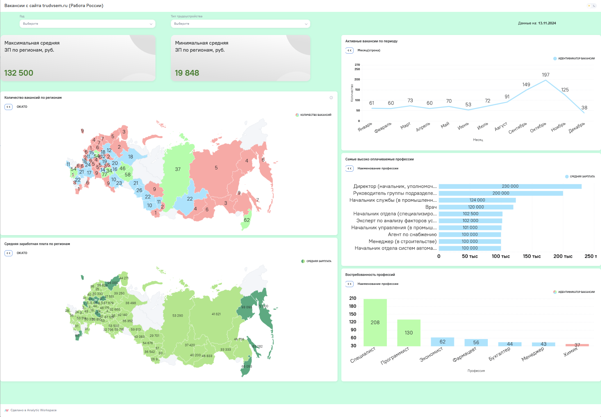

# Построение BI-дашборда на основе парсинга данных с сайта trudvsem.ru (Работа России)

## Ссылка на дашборд:
https://aw-demo.ru/public/dashboard/RhBA4TwbbGTYwJLbHTRJYDXEobt8drce?viewId=30eca942-34d2-4c76-892e-e84de62aac7d

## Задача
Забрать с интернет-ресурса https://trudvsem.ru/ данные о вакансиях, содержащих ключевое слово "аналитик".  
Построить аналитический дашборд на основе полученных данных.  
Обеспечить дальнейшее  регулярное обновление дашборда по инициативе пользователя.  

## Реализация
Все действия выполнялись в  BI-системе Analytic Workspace (AW BI). Это Российская BI-система, обладающая гибким функционалом, позволяющая  внутри себя выполнять, обработку данных с  
помощью SQL и pyspark-скриптов, использующая в качестве оркестратора ETL- Apache Airflow  

С помощью etl-скрипта (pyspark, requests) осуществляем парсинг данных с ресурса https://trudvsem.ru/, формируем из них датафрейм pyspark и загружаем в модель данных в AW BI.  
Далее создаем виджеты:   
1. кастомный с текущей датой (датой обновления информации в дашборде).  
2. статические виджеты типа "Тренд, выводящие на экран максимальную и минимальную среднюю зарплату по отдельно взятому региону.  
3. виджеты-карты, на которых отображены регионы РФ со статистической информацией по ним (кол-во вакансий и средняя зароботная плата).  
4. виджет, показывающий зависимость количества активных вакансий от месяца в году.   
5. виджеты с самыми высокооплачиваемыми и самыми востребоваными профессиями.   
Так же на дашборде присутствуют 2 фильтра: год, за который нужно отфильтровать вакансии и тип трудоустройства.   

В дальнейшем, при обращении к построенной при создании дашборда модели данных, мы можем в любой момент выгрузить актуальные даные с интернет ресурса  
https://trudvsem.ru/  и загрузить их во внутреннее хранилище BI-системы Analytic Workspace, тем самым актуализировав и наш дашборд.    

## Технологический стек:  
Pyspark, requests, SQL, Airflow, BI-система Analytic Workspace  

